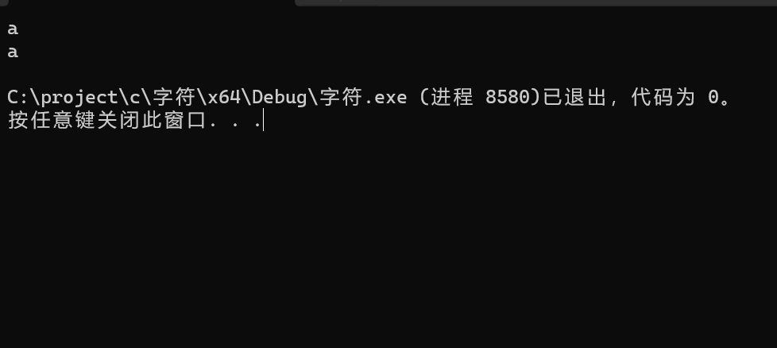
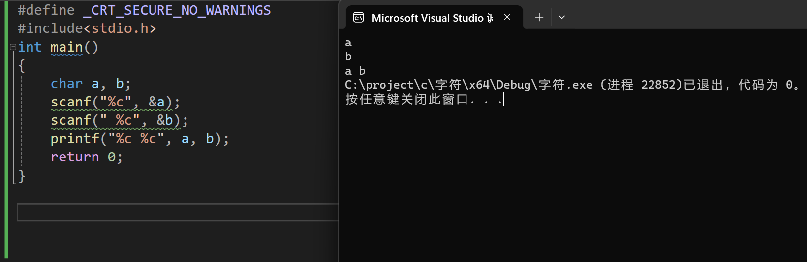
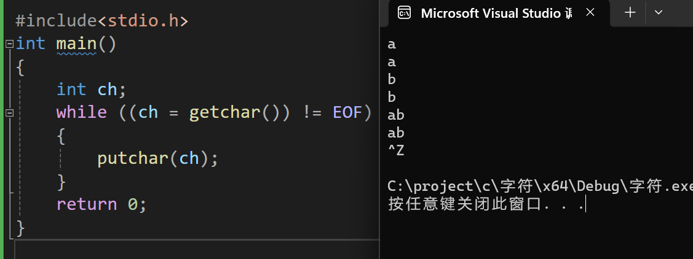
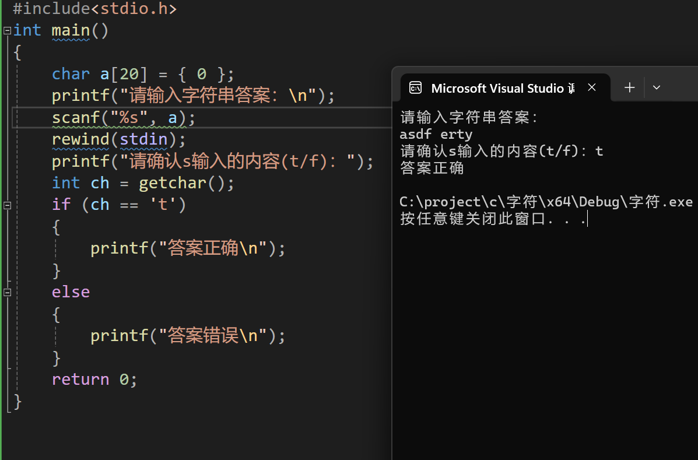
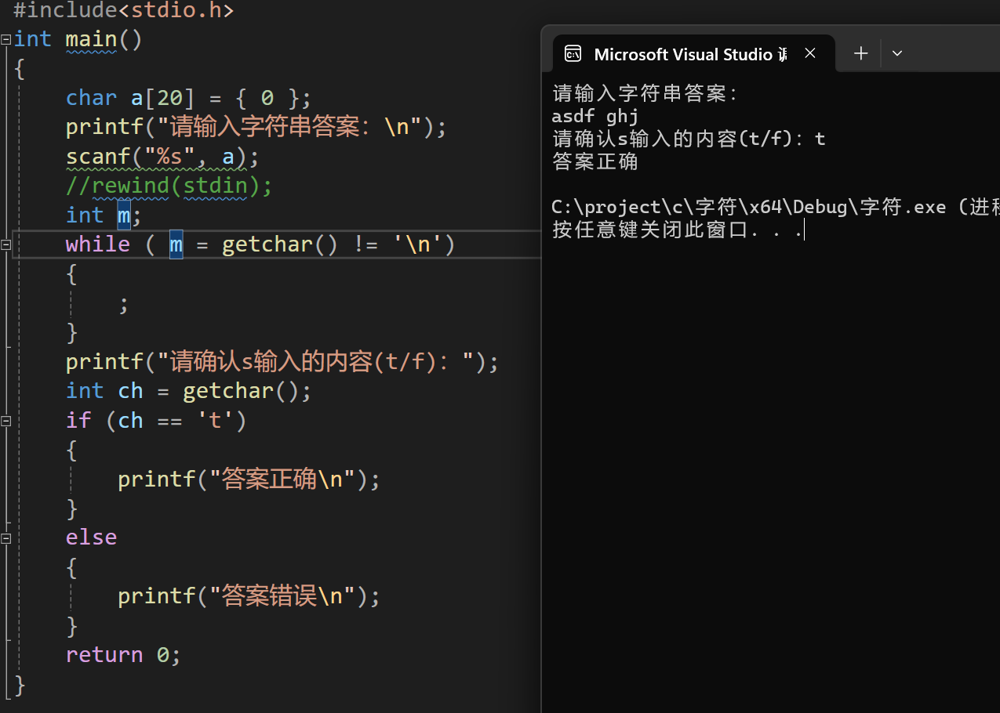
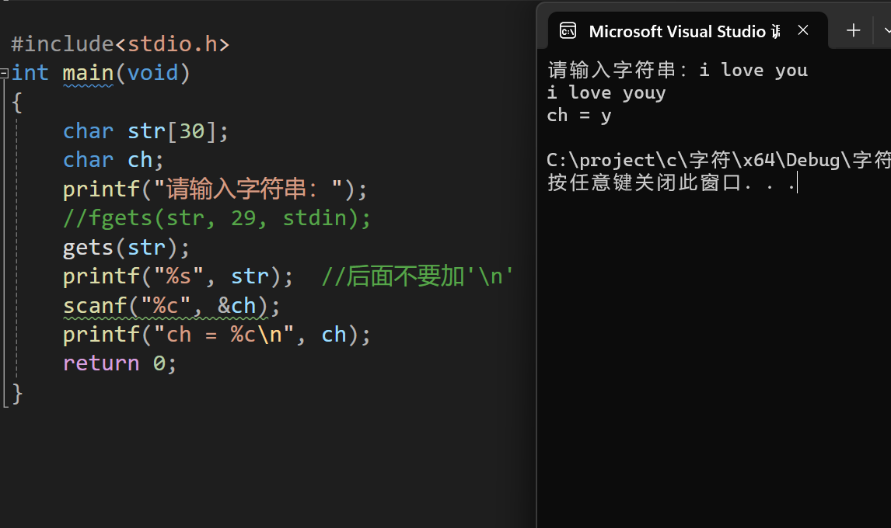

# 缓冲区是什么

​        **缓冲区**（Buffer)是内存空间的一部分。也就是说，在内存中预留了一定的存储空间，用来暂时保存输入或输出的数据，这部分预留的空间就叫做缓冲区。缓冲区根据其对应的是输入设备还是输出设备，分为***输入缓冲区***和***输出缓冲区***。

**输入缓冲区及例子**

​        **输入缓冲区**是我们经常忽视而导致出错的知识点。scanf和getchar等输入函数存在输入缓存用户从键盘输入内容,并按下**回车键**(即换行’\n’)确认,之后,输入的字符将进入输入缓冲区，然后输入函数便从输入缓冲区获取字符，并删除缓存区已获取的字符。

​    **下面举几个例子来具体分析一下**,

## scanf

```c
#include<stdio.h>
int main()
{
	char a, b;
	scanf("%c", &a);
	scanf("%c", &b);
	printf("%c %c", a, b);
	return 0;
}
```

当我们输入a和\n时，会出现：



当我们输入a和回车键(即'\n'时)，输入缓存区上此时有两个字符，分别是a和\n。于是，第一个scanf将a从输入缓冲区取出并打印在终端上，scanf()作单字符输入时规定只接收一个字符，**但它却把回车符也作为字符对待的**。于是第二个scanf则直接将输入缓冲区还存在的\n取出并打印在终端显示屏上，就有了如图所示的结果。

**正确做法如下：**



有了scanf(" %c",&c)这个空格（换成\n或者\t也可以），**这样就把缓冲区中的回车当成第一个字符，读取后丢掉**。

## getchar

### **getchar的用法**

getchar()函数的作用是从stdin (标准输入——键盘）获取字符，他的返回值类型是int，因为字符在存储时是以阿斯克码值存储的，所以getchar()读取的是**一个**字符而返回的却是**整形**，返回整形是返回了他的**阿斯克码值**，当getchar()读取错误的时候会返回EOF，EOF的含义就是end of file，是文件的结束标志。我们可以在编译器中转到定义发现EOF就是-1，也符合getchar()函数的返回值类型int。

### **getchar例子**

```c
#include<stdio.h>
int main()
{
	int ch;
	while ((ch = getchar()) != EOF)
	{
		putchar(ch);
	}
	return 0;}
```



将getchar()函数放在while循环当中作为条件，就可以实现连续输入和打印。用户键盘输入进入判断，如果getchar()正常获取字符那么我们进入循环打印字符，再次输入，如果getchar()获取字符异常返回EOF，那么就跳出循环。前面已经说过，getchar读取缓冲区内的**一个**字符，所以，每次循环读取缓冲区中的一个字符，直到缓冲区内字符都被读取完成后，继续在键盘上输入字符并存在输入缓冲区里，之后继续循环，每次读取缓冲区的一个字符，直到读取错误(即返回EOF)。


# 如何清理缓冲区的字符

## 用rewind函数刷新缓冲区

> 用rewind(stdin);**rewind函数是把指定流的读写指针重新指向开头。**



## 用getchar();来清理缓冲区

> 用getchar()函数，提前将缓冲区中的`\n`取走，就可达到我们想要的目的，这样的方法叫做清理缓冲区



如图我们将getchar()放入while循环当中就可以实现缓冲区中多个字符的清除，当scanf进入缓冲区获取字符时会拿取asdf，遇到空格scanf停止获取，之后进入循环getchar()进入缓冲区读取字符，只要没有读到\n循环就继续循环，遍历完缓冲区字符后，最后获取\n跳出循环，进行后一步操作。


# gets()与fgets()

## 区别

1、虽然用 gets() 时有空格也可以直接输入，但是 gets() 有一个非常大的缺陷，即它不检查预留存储区是否能够容纳实际输入的数据，换句话说，如果输入的字符数目大于数组的长度，gets 无法检测到这个问题，就会发生内存越界，一般用fgets().

2、 fgets() 和 gets() 一样，最后的回车都会从缓冲区中取出来。**只不过 gets() 是取出来丢掉，而 fgets() 是取出来自己留着**。但总之缓冲区中是没有回车了！所以与 gets() 一样，在使用 fgets() 的时候，如果后面要从键盘给字符变量赋值，那么同样**不需要清空缓冲区**。

>  **fgets(str, 7, stdin);  从输入流stdin即输入缓冲区中读取7个字符到字符数组str中**

3、所以假如你定义的字符数组长度为 n，那么 fgets() 中的 size 就指定为 n–1，留一个给 '\0' 就行了。但是需要注意的是，如果输入的字符串长度没有超过 n–1，那么系统会将最后输入的换行符 '\n' 保存进来，**保存的位置是紧跟输入的字符**，然后剩余的空间都用 **'\0' 填充**。所以此时输出该字符串时 printf 中就不需要加换行符 '\n' 了，因为字符串中已经有了。

## 有关缓冲区的例子：

### 用fgets()

```c
#include<stdio.h>
int main()
{
 char str[30];
 char ch;
 printf("请输入字符串：");
 fgets(str, 29, stdin);
 printf("%s", str);  //后面不要加'\n'
 scanf("%c", &ch);
 printf("ch = %c\n", ch);
 return 0;
}
```


**输出结果是：**
请输入字符串：i love you
i love you
Y
ch = Y

### 用gets()

```
#include<stdio.h>
int main(void)
{
char str[30];
char ch;
printf("请输入字符串：");
gets(str);
printf("%s", str);  //后面不要加'\n'
scanf("%c", &ch);
printf("ch = %c\n", ch);
return 0;
}
```



输入同样的数据，结果却不一样，如图所示，再一次说明了fgets() 和 gets() 一样，最后的回车都会从缓冲区中取出来。只不过 gets() 是取出来**丢掉**，而 fgets() 是取出来**自己留着**。


# 总结

> 1、rewind通过**刷新缓冲区**(相当于能瞬间将缓冲区还存在的所有字符清除)。
>
> 2、getchar则只能每次读取缓冲区的**一个字符**来清理缓冲区，一般需要通过**循环**来清理缓冲区，使用**while((ch = getchar()) != ‘\n’ && ch != EOF)**（万能代码）。
>
> 3、scanf遇到**空格**和**\n**会停止从缓冲区读取字符。
>
> 4、getchar()函数的作用是从标准输入键盘中**读取一个字符**。
>
> 5、getchar()的返回值类型为**整形**，返回的是读取到字符的**阿斯克码值**。
>
> 6、当getchar()函数读取失败时，**返回EOF**文件的结束标志。
>
> 7、fgets(str, 7, stdin);  表示从输入流stdin即**输入缓冲区**中读取7个字符到字符数组str中。
>
> 8、fgets() 和 gets() 一样，最后的回车都会从缓冲区中取出来。只不过 gets() 是取出来**丢掉**，而 fgets() 是取出来**自己留着**。
